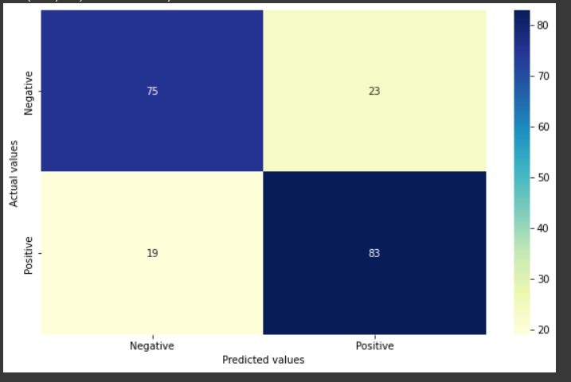
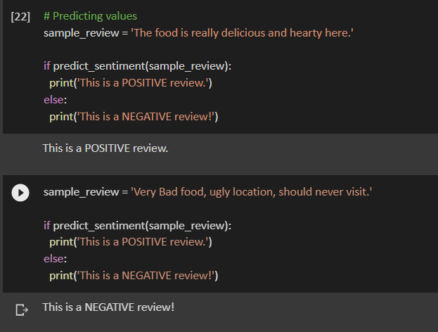
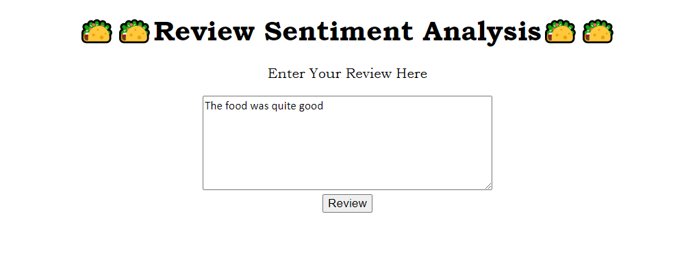
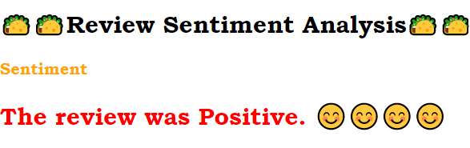
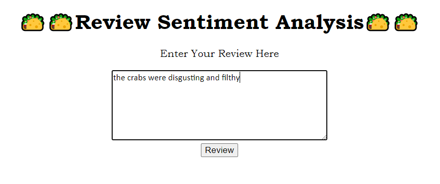
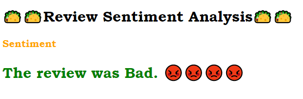

# Restaurant Review Sentiment Analysis Project

## Project Overview
• Created a machine learning model that **detects/classifies a review into a positive or negative review based on the textual data using Natural Language Processing.** 

## How will this project help?
• This project **helps in categorising the reviews into positive or negative.**

## Resources Used
• Packages: **pandas, numpy, sklearn, matplotlib, seaborn, nltk.** 

## Exploratory Data Analysis (EDA)
• Checked that the training data is balanced.

## Data Cleaning
• Removing special character and numbers using regular expression 
• Converting the entire sms into lower case 
• Tokenizing the sms by words 
• Removing the stop words 
• Lemmatizing the words 
• Joining the lemmatized words 
• Building a corpus of messages

## Model Building and Evaluation
**Metric: F1-Score** 
• Random Forest: 0.714 
• **Multinomial Naive Bayes: 0.79** 
 
_**Note: Evaluation scores are obtained using cross validation.**_

## Predictions

## Model Deployment

• Web App Link: https://reviewsentimentanalysis0101.herokuapp.com 
